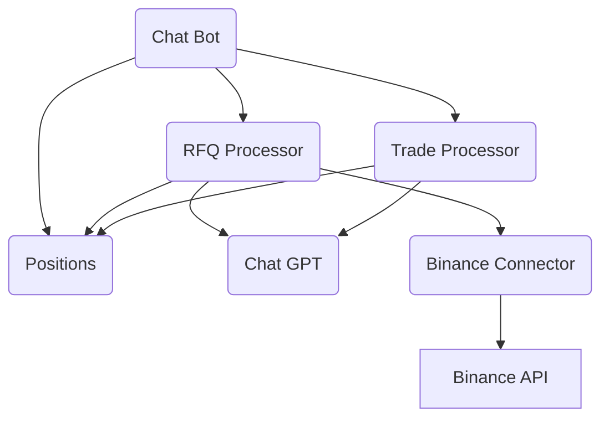

# Supernova RFQ Bot
This is a Python-based Telegram bot for processing cryptocurrency trading requests. The bot can interpret "request for quote" (RFQ) messages sent in plain text, process trades and provide RFQ responses. It interacts with Binance's spot market to provide real-time price and size information. It uses GPT-3.5-turbo model from OpenAI to parse and understand the RFQs.

## Modules
The bot is organized into several modules:

__chat_bot.py__: This is the main script for the bot. It handles the startup, and sets up the commands and responses for the bot. It also provides the main function to start the bot.

__positions.py__: This module is responsible for managing the bot's current positions in various cryptocurrencies.

__rfq_processor.py__: This module is responsible for processing RFQs. It communicates with the Binance connector and the chatgpt module to parse and understand the requests, and calculate prices.

__trade_processor.py__: This module is responsible for executing trades based on the RFQs and user instructions.

__chatgpt.py__: This module uses OpenAI's GPT-3.5-turbo model to parse and understand RFQs based on certain instructions.

## Component diagram


## Architectural decisions

__Modular Design__: The application is structured into distinct modules, each responsible for specific functionality (i.e., chat bot operation, request for quote processing, trade processing, and position management). This design promotes better code organization, easy maintenance, and enhances the scalability of the application.

__Integration with External Services__: The application is integrated with both OpenAI's GPT model and Binance's API. By delegating natural language processing to GPT and market data retrieval and trade execution to Binance, the application focuses on its core logic, thus improving efficiency and reducing the need for in-house development of these complex functionalities.

__AI-Based User Request Parsing__: The system leverages AI to interpret and process user requests. This approach enables a natural language interface for the users, enhancing the overall usability and user experience.

__Secure Handling of Sensitive Data__: API keys and other sensitive information are stored as environment variables. This technique ensures that such sensitive data is not directly embedded in the code, mitigating the risk of data leakage especially when codebases are shared or publicly accessible.

## Environment Variables
__SUPERNOVA_BOT_KEY__: Your Telegram bot token, which can be obtained by creating a new bot on Telegram via BotFather.

__OPENAI_API_KEY__: Your OpenAI API key, which is used for the GPT-3.5-turbo model.
## Bot Commands
The bot supports the following commands:

__/start__: Initiates the bot.

__/rfq__: Processes an RFQ. The RFQ details are expected to be passed in as command arguments.

__/trade__: Executes a trade. The trade instructions are expected to be passed in as command arguments.

Running the Bot
Ensure that the environment variables SUPERNOVA_BOT_KEY and OPENAI_API_KEY are set in your environment. Then you can start the bot by running the chat_bot.py script:

## How to run
```
python chat_bot.py
```
## Example Usage
After initiating the bot with the /start command, you can send an RFQ such as "/rfq 100 BTC". The bot will then provide a quote for buying or selling 100 BTC.

To execute a trade, you can use the /trade command, for example "/trade mine" to execute a buy trade.

## Dependencies

__python-telegram-bot__: A Python wrapper for the Telegram Bot API.

__openai__: Python client library for the OpenAI API.

__json__: Lightweight data interchange format inspired by JavaScript object literal syntax.

__functools__: Includes higher-order functions and operations on callable objects.

__collections__: Implements specialized container datatypes providing alternatives to Python’s general purpose built-in containers.

## Future milestones

__Enhanced Error Handling__: Implement comprehensive error handling mechanisms to ensure the bot can handle various edge cases, such as incorrect or malformed user inputs. This will improve user experience and reduce potential errors.

__Refined NLP Capabilities__: Enhance the bot's natural language processing capabilities by leveraging advanced NLP techniques and training it with diverse datasets. This will enable the bot to better understand and accurately process user inputs, resulting in more effective and meaningful responses.

__Improved User Interface__: Develop a user-friendly interface, potentially through a graphical user interface (GUI), to make the bot more accessible and intuitive for users. This will enhance the user experience and make the trading process more convenient and enjoyable.

__User Authorization and Personalization__: Implement a robust user authentication and authorization system to personalize the bot's responses and ensure the security of user data. This will enhance user engagement, trust, and provide a personalized experience.

__Price Skewing Strategies with ChatGPT__: Utilize ChatGPT's capabilities to develop sophisticated price skewing strategies. By training ChatGPT on historical market data and incorporating current market conditions, the bot can dynamically adjust prices to capitalize on bullish or bearish trends, trading volumes, and liquidity. This will improve trading profitability and responsiveness to market dynamics.

__Hedging Utilizing ChatGPT__: Harness the power of ChatGPT to optimize hedging strategies. ChatGPT can analyze market data, news, and user inputs to provide valuable insights on potential hedging opportunities. By integrating ChatGPT into the hedging process, the bot can make more informed decisions and effectively mitigate risk.
